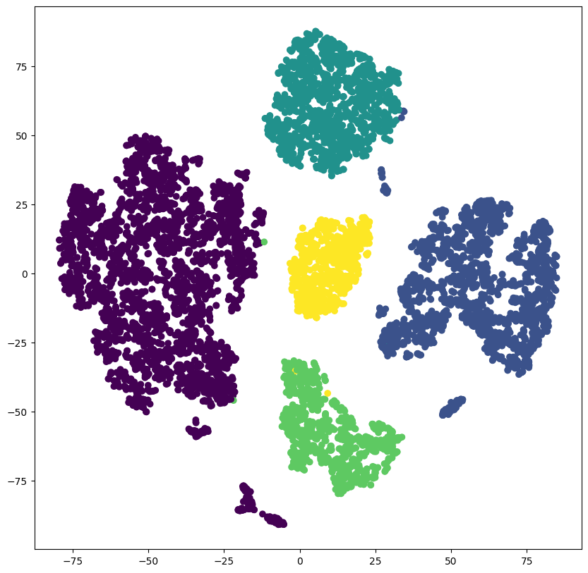

# Hierarchical Clustering Project

## Table of Contents
1. [Introduction](#1)
2. [Dataset](#2)
3. [Data Investigation](#3)
4. [Data Preprocessing](#4)
5. [Feature Transformation](#5)
6. [Clustering Methods](#6)
7. [Improvement Ideas](#7)
8. [Conclusion](#8)
9. [Dependencies](#9)

## 1. Introduction
This project aims to perform hierarchical clustering on a credit card dataset. The steps include reading the dataset, investigating the data, preprocessing it, transforming features, applying clustering algorithms, and interpreting the results.

## 2. Dataset
The dataset used in this project is the "Credit Card Data Clustering" dataset, which can be downloaded from [Kaggle](https://www.kaggle.com/code/sadkoktaybicici/credit-card-data-clustering-k-mean/data).

## 3. Data Investigation
In this section, the data is investigated for quality and assessed for issues such as:
- Null values
- Data types
- Outliers
- Duplicate rows
- Distribution of each column (skewness)

Key findings:
1. Some columns contain null values.
2. The `CUST_ID` column is not necessary for clustering.
3. Certain columns have linear relationships.
4. Most columns are highly skewed.

## 4. Data Preprocessing
Based on the issues identified:
1. Null values are filled with the mean of respective columns.
2. The `CUST_ID` column is dropped.
3. Columns with high linear relationships are dropped.
4. Various scaling techniques are applied to address skewness.

## 5. Feature Transformation
Different scaling techniques are applied to normalize the data:
- Log Transformation
- Quantile Transformation
- Standard Scaling
- Min-Max Scaling
- Robust Scaling

Dimensionality reduction techniques such as PCA and Kernel PCA are also explored.

## 6. Clustering Methods
Various clustering methods are applied to the transformed data:
1. **K-Means Clustering**: The elbow method is used to determine the optimal number of clusters.
2. **Agglomerative Clustering**: Different linkage criteria and distance functions are evaluated using dendograms.
3. **DBSCAN**: Density-based clustering method.
4. **Gaussian Mixture Models**: Probabilistic clustering approach.
5. **Isolation Forest**: Anomaly detection method adapted for clustering.

## 7. Improvement Ideas
- Use PCA to reduce the number of features and compare the clustering results.
- Try different transformation techniques and observe their impact on clustering.
- Implement the gap statistics method to determine the optimal number of clusters.

## 8. Conclusion
The dataset was divided into five clusters, with each cluster representing a unique customer profile. Key observations include:
- Cluster 0: Customers with low balance but frequent purchases, preferring installment payments over cash advances.
- Cluster 1: Customers with moderate balance but no purchases or cash advances, likely inactive.
- Cluster 2: Users with high balance and moderate purchases.
- Cluster 3: Customers with moderate balance and low purchases, making one-off purchases without installment payments or cash advances.
- Cluster 4: Users with low balance and moderate purchases, making one-off purchases without installment payments or cash advances.

## 9. Dependencies
- Python 3.x
- pandas
- numpy
- matplotlib
- seaborn
- scikit-learn
- scipy

